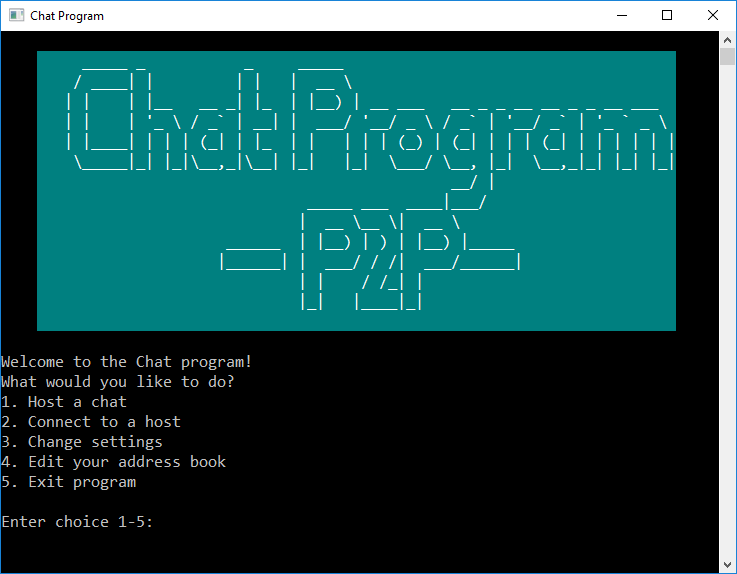
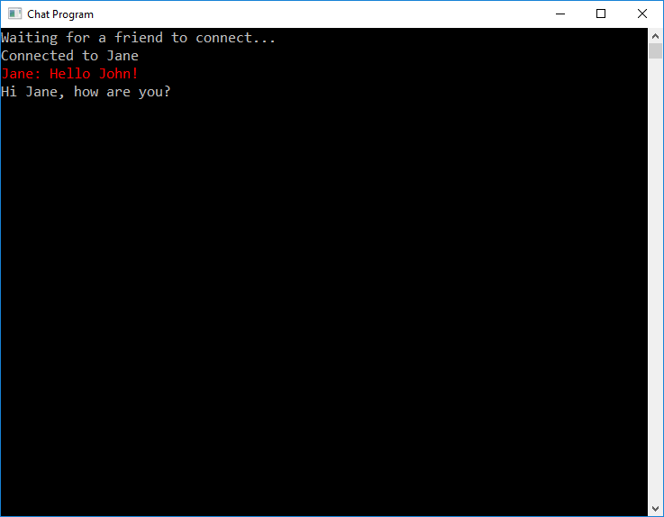

Advanced chat system, P2P!
===
*Created by: Jonas Norlinder, Adam Inersjö and Lotta Åhag*

How it looks
---

Dependencies
---
ansi-terminal-0.6.2.3 and strict-0.3.2

Instructions
---
Run cabal install ansi-terminal and/or cabal install strict if any of the package's is missing.

Error codes:
>1    - Invalid choice

>2    - Index out of bounds

>3    - Not a Number (NaN)

>11   - Invalid Port

>12   - Invalid IP

>13   - Invalid Name 
